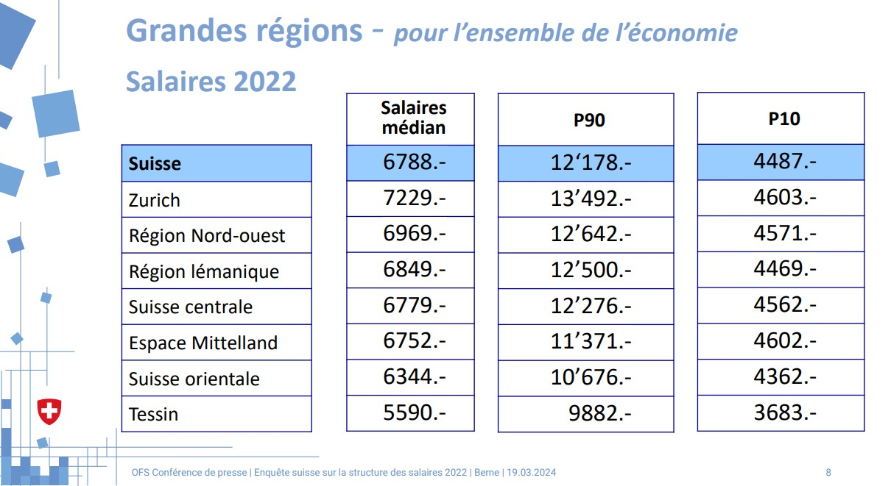
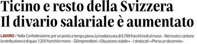
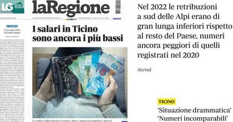

---
output:
  xaringan::moon_reader:
    css: [default, "metropolis_ustat.css", "metropolis-fonts", "specifici.css"]
    lib_dir: immagini
    nature:
      highlightStyle: github
      highlightLines: true
      countIncrementalSlides: false
      ratio: 16:9
    seal: false
    includes:
      after_body: insert-logo.html
---

```{r setup, include=FALSE}
rm(list=ls())

options(htmltools.dir.version = FALSE)

knitr::opts_chunk$set(fig.width=4.25, fig.height=3.5, fig.retina=3,
                      message=FALSE, warning=FALSE, cache = TRUE, 
                      autodep = TRUE, hiline=TRUE
                      , dev = "svg"
                      )

options(knitr.kable.NA = '')
# source(file = "Figure.R", encoding = "UTF-8")
```

class: title-slide clear


# **Neuchatel... we have a problem**

<br>
<br>
<br>
<br>

### .font60[**Ethik - Vertrauen, Éthique - confiance |** Atelier VI]
### .font85[Eric Stephani | Ufficio di statistica, Ustat]
### .font70[.mid-warm-grey[Journées suisses de la statistique 2024 | *Aarau, mercredi 04 septembre 2024*]]

---
# Neuchatel... we have a problem

.pull-left[

.img-left[
```{r, echo = FALSE}
magick::image_read("immagini/fig1.jpg")

```

]
]

--

.pull-right[
.hl[**Voie de secours**]

.font80[
.mid-warm-grey[1. ] La crédibilité selon le Conseil d'éthique  
.mid-warm-grey[2. ] Crédibilité et statistiques des salaires  
.mid-warm-grey[3. ] Perceptions et statistiques 
<br>  
.mid-warm-grey[-->] Changements, expériences, discussion  
<br>  

]
]


---
class: hide-logo, inverse, center, middle

# .font80[1.] La crédibilité, pierre angulaire de la statistique publique

<br>

.font70[.mid-warm-grey[Ethikrat (2019), [link](https://www.conseilethique-stat.ch/fr/assets/File/empfehlungen/20191105_Cr%C3%A9dibilit%C3%A9_Recommandation_Conseil%20d'%C3%A9thique.pdf)

]]

---
class: clear


.font70[
.left-column[

<br>
#### Confiance et credibilité

]
]

.font80[
.right-column[

<br>
### La charte de la statistique publique

*« Avec la Charte de la statistique publique de la Suisse, elle s'est dotée d'un code de bonnes pratiques visant à .hl[garantir la confiance] dans la statistique publique. »*
.font60[
.mid-warm-grey[Source: [Ethikrat, 2019](https://www.conseilethique-stat.ch/fr/assets/File/empfehlungen/20191105_Cr%C3%A9dibilit%C3%A9_Recommandation_Conseil%20d'%C3%A9thique.pdf)

]
]
]
]

--

.font80[
.right-column[

<br>
### Credibilité à la base de la confiance

*"La crédibilité est le fondement de la confiance : si la source est crédible, on a confiance dans la qualité des méthodes utilisées, dans le contenu et la pertinence des informations diffusées."*  

]
]

---
class: clear


.font70[
.left-column[

<br>
#### Confiance et credibilité
#### Point de départ

]
]


.font80[
.right-column[

<br>
### Comment être crédible ?

*La crédibilité est basée sur les qualités que le bénéficiaire attribue aux personnes et aux institutions et à leurs résultats. Ces qualités sont principalement :*  
- *un comportement digne de foi et*  
- *une compétence professionnelle, qui se juge aux connaissances et à la .hl[**capacité**] de .hl[produire] et .hl[communiquer] des informations pertinentes et objectives* 

]
]

---
# Capacité comme mesure de crédibilité

.pull-left[

```{r, echo = FALSE}
magick::image_read("immagini/fig3.jpg")

```

]

.font80[
.pull-right[
##### *Indicateurs de production*

```{r, echo = FALSE, results = "asis"}
source("T1_tabella.R", encoding = "UTF-8")
t1

```

]
]


---
# Capacité comme mesure de crédibilité (2)

.pull-left[
```{r, echo = FALSE}
magick::image_read("immagini/fig2.jpg")

```
]


.font80[
.pull-right[
##### *Indicateurs de divulgation*

```{r, echo = FALSE, results = "asis"}
source("T1_tabella.R", encoding = "UTF-8")
t2

```
]
]


---
class: hide-logo, inverse, center, middle

# .font80[2.] Salari e statistiche

<br>

.font70[.mid-warm-grey[Camera di commercio Cantone Ticino, Cc-Ti (2024), [link](https://www.cc-ti.ch/salari-e-statistiche)

]]

---
class: clear


.font70[
.left-column[

<br>
#### Résultats ESS

]
]

.right-column[
.font50[
.mid-warm-grey[**19 mars** 2024, Présentation des résultats ESS 2022, Conférence de presse, OFS

]
]

.img-left[



]
]

---
class: clear


.font70[
.left-column[

<br>
#### Résultats ESS
#### Les réactions des *médias*

]
]

.right-column[

.font50[
.mid-warm-grey[**20 marzo** 2024, Corriere del Ticino

]
]

.img-left[


.img-left[

]
]
]

--

.right-column[
.font50[
.mid-warm-grey[**20 marzo** 2024, La Regione 

]
]

.img-left[

]
]

---
class: clear


.font70[
.left-column[

<br>
#### Résultats ESS
#### Les réactions des *médias*
#### Les réactions des... *autres*

]
]

.right-column[
.font50[
.mid-warm-grey[**20 marzo** 2024, La Regione
]
]

.font60[
.hl[A1]
> *«È impensabile che in un paese come la Svizzera questo genere di analisi non venga fatta almeno ogni sei mesi»*

.hl[A2]
> *«Queste statistiche lasciano il tempo che trovano. Il Ticino figura come cantone, contro altre zone che sono invece delle regioni»*

]
]

--

.right-column[
.font50[
<br>
.mid-warm-grey[**26 marzo** 2024, Communiqué de la Cc-Ti ][link](https://www.cc-ti.ch/salari-e-statistiche)
]

.font60[

**Statistiche e salari**  
*«Ecco una di quelle contraffazioni della realtà che, ripetute per anni, sono diventate una verità incontestabile. .hl[Ma le cose stanno veramente così?] Non proprio. Indubbiamente una differenza salariale esiste, ma non dell’entità che si vuol far credere, sfruttando delle “distorsioni” statistiche al solo scopo di dimostrare che nel nostro Cantone i “padroni” sono disonesti» *

]
]

--

.right-column[
.font50[
<br>
.mid-warm-grey[**20 aprile** 2024, Corriere del Ticino, *médiatisation* de la Lettre envoyée à l'OFS ]

]

.img-left[


]
]

---
class: clear

.font70[
.left-column[
#### Pourquoi le Tessin seulement? Et les salaires en Valais? Dans le Jura?...
#### Comment que -en termes de PIB par habitant- le Tessin figure au 8e rang?
#### ...

]
]

.img-left[]

--

.right-column[
.font80[
Est-ce que le fait de posséder une capacité de produire et de communiquer est-elle vraiment suffisante? Ou, dans ce cas, il y a eu une **perte de crédibilité**?

]]

--

.right-column[
.font80[
.pull-left[
.hl[OUI]
.font50[  ...et donc]
]

.pull-right[
NON


]
]
]

--

.font80[
.right-column[

.font60[*« Avec la « Charte de la statistique publique de la Suisse », elle s'est dotée d'un code de bonnes pratiques visant à garantir la confiance dans la statistique publique.*] *Cependant, cette confiance doit être développée et constamment entretenue. .hl[La communication et le dialogue avec toutes les parties prenantes jouent ici un rôle décisif.]»*  

.font60[
[Source: Ethikrat (2019)](https://www.conseilethique-stat.ch/fr/assets/File/empfehlungen/20191105_Cr%C3%A9dibilit%C3%A9_Recommandation_Conseil%20d'%C3%A9thique.pdf)

]
]
]


---
class: hide-logo, inverse, center, middle

# .font80[3a.] Les anticipation d'inflation des ménages

<br>

.font70[
.mid-warm-grey[
C. Hepenstrick et al. (2024). La Vie économique, Seco, Berne. [link](https://dievolkswirtschaft.ch/fr/2024/03/les-anticipations-dinflation-des-indicateurs-precieux-pour-la-politique-monetaire)

]
]

---
class: clear

.font70[
.left-column[
#### Indice de crédibilité

]
]


.right-column[

```{r, echo = FALSE, fig.width = 11.5, fig.height = 8}
source("F1_fin.R", encoding = "UTF-8")
p
```

]

---
class: clear

.font70[
.left-column[
#### Indice de crédibilité
#### Indice de crédibilité (2)

]
]


.right-column[

```{r, echo = FALSE, fig.width = 11.5, fig.height = 8}
p2
```

]

---
class: clear

.font70[
.left-column[
#### BNS, indice de crédibilité
#### BNS, indice de crédibilité (2)
#### Fact-check, perceptions de la croissance des prix vs. IPC

]
]


.right-column[

```{r, echo = FALSE, fig.width = 11.5, fig.height = 8}
source("F2_fin.R", encoding = "UTF-8")
g
```

]

---
class: clear

.font70[
.left-column[
#### BNS, indice de crédibilité
#### BNS, indice de crédibilité (2)
#### Fact-check, IPC vs. seco
#### Fact-check (2), perceptions vs. IPC, 1985-1994

]
]


.right-column[

```{r, echo = FALSE, fig.width = 11.5, fig.height = 8}
source("F2_fin.R", encoding = "UTF-8")
p0
```

]

---
class: clear

.font70[
.left-column[
#### L'IPC est-il inutile!
#### Et les primes d'assurance maladie?
#### Pourquoi n'existe pas un indice du coût de la vie?
#### ...

]
]

.img-left[]

--

.right-column[
.font80[
Il y a une perte de crédibilité?

]]

--

.right-column[
.font80[
.pull-left[
.hl[OUI]
.font50[  ...et donc]
]

.pull-right[
NON


]
]
]


.right-column[
.font80[
<br>
- Quoi faire? Comment?   
--> À quel .hl[niveau?]  
- Quand?  
--> Avec quelle .hl[urgence]  

]]

---
class: hide-logo, inverse, center, middle

# .font80[3b.] Sécurité de l'emploi et statistiques du chômage

---
class: clear

.font70[
.left-column[
#### Sécurité de l'emploi et statistique du chômage ILO

]
]


.right-column[

```{r, echo = FALSE, fig.width = 11.5, fig.height = 8}
source("F3_fin.R", encoding = "UTF-8")
g
```
]

---
class: clear

.font70[
.left-column[
#### Sécurité de l'emploi et statistique du chômage ILO
#### Sécurité de l'emploi et statistique du chômage SECO

]
]


.right-column[

```{r, echo = FALSE, fig.width = 11.5, fig.height = 8}
source("F4_fin.R", encoding = "UTF-8")
v
```
]

---
class: clear

.font70[
.left-column[
#### Très bien!
#### Population parfaitement informée
#### ...

]
]

.img-left[]

--

.right-column[
.font80[
Il y a une perte de crédibilité?

]]


.right-column[
.font80[
.pull-left[
OUI
]

.pull-right[
.hl[NON]
.font50[  ...mais]
]

]
]

--

.right-column[
.font80[
<br>
- Qui produit l'indice de confiance des consommateur?     
.font70[.hl[-->] L'OFS a des statistiques subjectives comparables?]    
- Qui produit l'indice de confiances des entreprises en Suisse?    
- Dans le panorama internationale, en matière de statistiques subjectives, les statistiques officielles suisses sont-elles plutôt précurseurs ou, au contraire, plutôt en retard?

]
]

---
# 4. Conclusion

.pull-left[

```{r, echo = FALSE}
magick::image_read("immagini/fig4.jpg")

```

.font60[*« .hl[La confiance doit être développée et constamment entretenue]. La communication et le dialogue avec toutes les parties prenantes jouent ici un rôle décisif.»*  

]
.font50[
[Source: Ethikrat (2019)](https://www.conseilethique-stat.ch/fr/assets/File/empfehlungen/20191105_Cr%C3%A9dibilit%C3%A9_Recommandation_Conseil%20d'%C3%A9thique.pdf)

]
]

--

.pull-right[
.font80[

##### Changements, experiences, discussion
<br>

.white[']- Niveau USTAT  
.white[']- Niveau OFS  
.white[']- Niveau *internationale*  

]

.font50[
<br>
<br>
<br>
<br>
<br>
<br>
<br>
<br>
<br>
<br>
<br>
<br>
<br>

.mid-warm-grey[
Slides crées avec R via: [{r-project}](https://www.r-project.org), [{xaringan}](https://github.com/yihui/xaringan) e [{schedeustat}]()

]
]
]


---
# Médiagraphie

<br>
.font70[
- Le Conseil d’éthique de la statistique publique suisse (2019). *La crédibilité en tant que pierre angulaire de la statistique publique*
.font60[ --> 
    [  https://www.conseilethique-stat.ch/fr/assets/File/empfehlungen/20191105_Cr%C3%A9dibilit%C3%A9_Recommandation_Conseil%20d'%C3%A9thique.pdf](https://www.conseilethique-stat.ch/fr/assets/File/empfehlungen/20191105_Cr%C3%A9dibilit%C3%A9_Recommandation_Conseil%20d'%C3%A9thique.pdf)
    
    ]    
    
- CC-TI, Camera di commercio cantone Ticino (2024). *Salari e statistiche*
.font60[ --> 
    [  https://www.cc-ti.ch/salari-e-statistiche](https://www.cc-ti.ch/salari-e-statistiche)
    ]  
    
- OFS, conférence de presse (2024). *Enquête suisse sur la structure des salaires en 2022: premiers résultats*
.font60[ --> 
   [  https://www.bfs.admin.ch/bfs/fr/home.agendadetail.2023-0460.html](https://www.bfs.admin.ch/bfs/fr/home.agendadetail.2023-0460.html)
   ]  
   
- BNS, prévisions et analyses. Hepenstrick, Pirschel et Scheufele (2024). *Les anticipations d’inflation, des indicateurs précieux pour la politique monétaire*. La Vie économique, Seco.
.font60[ --> 
  [  https://dievolkswirtschaft.ch/fr/2024/03/les-anticipations-dinflation-des-indicateurs-precieux-pour-la-politique-monetaire](https://dievolkswirtschaft.ch/fr/2024/03/les-anticipations-dinflation-des-indicateurs-precieux-pour-la-politique-monetaire)
  ]   
  
- ISTAT, Direzione centrale per la comunicazione, informazioni e servizi ai cittadini e agli
utenti. Caporrella, Cortese (2024). *Tra percezione e realtà: il ruolo dei numeri in Statistica e Cittadinanza*
.font60[ --> 
[  https://www.istat.it/storage/15-Conferenza-nazionale-statistica/poster/07_22_Caporrella_POSTER.pdf](https://www.istat.it/storage/15-Conferenza-nazionale-statistica/poster/07_22_Caporrella_POSTER.pdf)
]

]


---
class: title-slide-fin clear hide-logo


# .white[.]

.font70[
.pull-right2[

#### **Contatti**
Eric Stephani  
[eric.stephani@ti.ch](mailto:eric.stephani@ti.ch)  

.white[ ]
Repubblica e Canton Ticino  
Divisione delle risorse  
**Ufficio di statistica**  
[www.ti.ch/ustat](http://www.ti.ch/ustat)  

]
]

